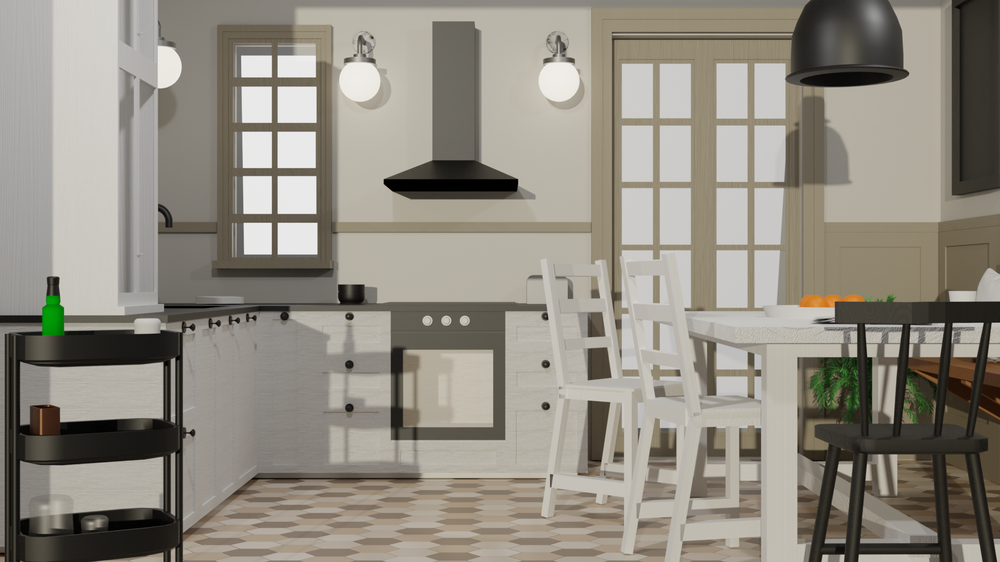

# Virtual and Augmented Reality Systems

*Leggi in inglese: [English](README.md).*

Progetto di Realtà Virtuale

Questo progetto è un esame per il corso di Virtuale. 
Il corso è stato frequentato senza avere basi di modellazione tridimensionale. 
Partendo dalla creazione di semplici oggetti, via via senpre più complessi per poi poterli renderizzare o usarli su Unity per la creazione di un ambiente.

# Prime modellazioni
Nelle prime lezioni sono state affrontate i comandi base per potersi muovere la meglio nell'intefaccia grafica di blender, attraverso l'utilizzo si *shortcut*.

Uno delle prime prove svolte è stata la creazione di una panchina con dei cespugli al lato e un lampione, con all'interno della sfera del lampione una luce. In questo caso non vi sono stati utilizzi di funzioni per l'arrotondamento. 

# Provare a sperimentare 
con il passare delle lezioni abbiamo  sperimenato le diverse tipologie di modellazione e arrotondamento, con applicazione di diversi tipologie di luci. Imparando a posizione le diverse tipologie di luci a seconda del risultato che vogliamo. Inoltre abbiamo appreso la modiifica delle texture, cosi da poter creare un materiale specifico, ovvero il vetro. 

# Progetto finale 
L'esame consiteva nel riprodurre una stanza presa in maniera randominca dal sito IKEA e replicarla in Blender; succivamente esportarla in Unity e rendere possibile esplorazione.

La stanza da replicare era una cucina: 

Attraverso una serie di passagi, il risultato ottenuto è questo:

