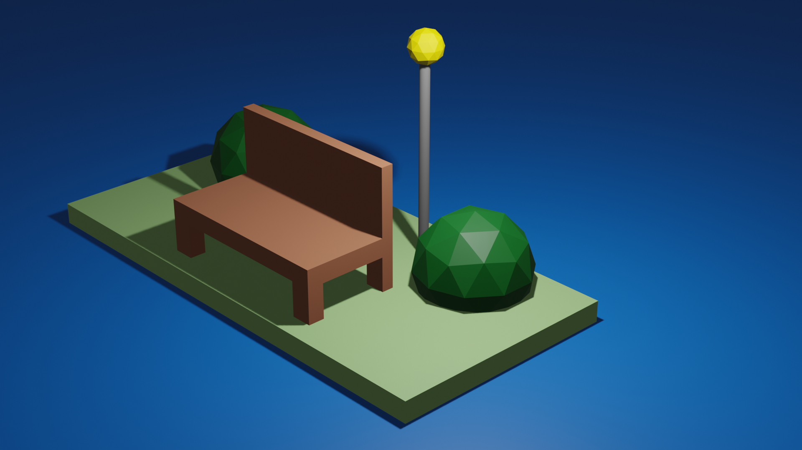
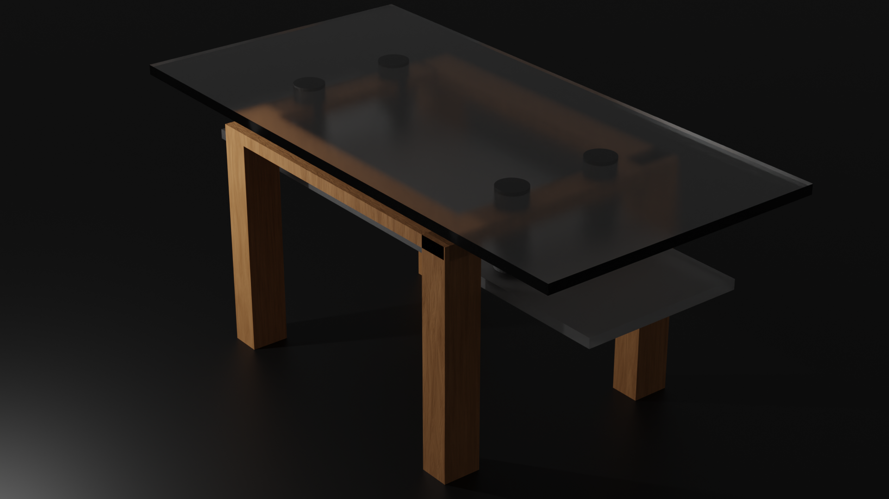
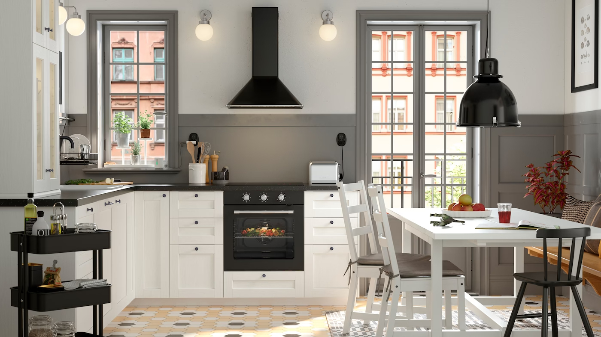
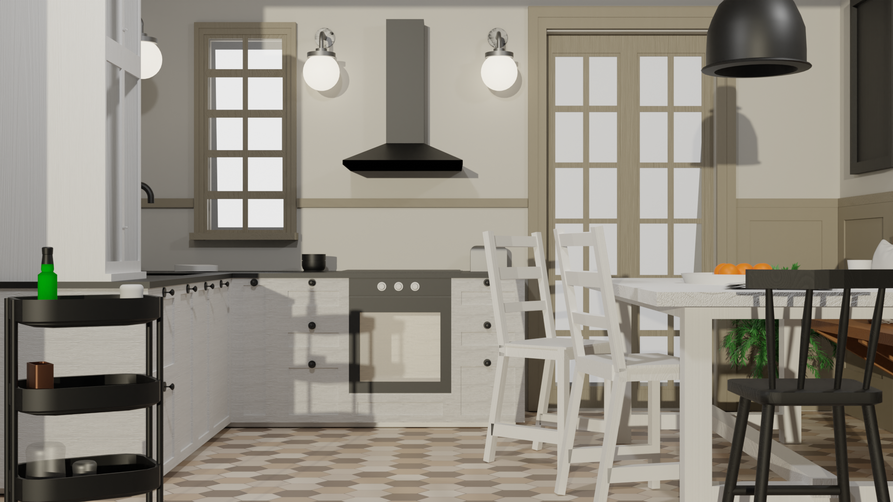

# Virtual and Augmented Reality Systems
*Read this in other languages: [Italy](README.IT.md).*

Virtual reality project

This project is an exam for the Virtual course. 
The course was attended without having any basis in three-dimensional modeling. 
Starting from the creation of simple objects, gradually becoming more complex and then being able to render them or use them on Unity to create an environment.

# First modeling
In the first lessons we covered the basic commands to be able to move better in the blender graphic interface, through the use of *shortcuts*.

One of the first tests carried out was the creation of a bench with bushes at the side and a street lamp, with a light inside the sphere of the street lamp. In this case there were no uses of rounding functions.

# Try experimenting 
as the lessons went by we experimented with different types of modeling and rounding, with the application of different types of lights. Learning how to position the different types of lights depending on the result we want. We also learned how to modify textures, so as to be able to create a specific material, namely glass. 

# Progetto finale 
L'esame consiteva nel riprodurre una stanza presa in maniera randominca dal sito IKEA e replicarla in Blender; succivamente esportarla in Unity e rendere possibile esplorazione.

La stanza da replicare era una cucina: 

Attraverso una serie di passagi, riportati sulla presentazione il risultato ottenuto è questo:

